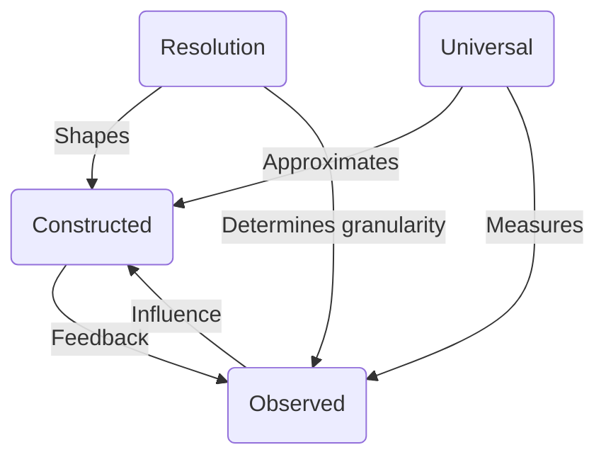

```tikz
Based on the discussion and the modifications we decided to implement, here is the final TikZ code for the improved diagram:

### Final Code
```latex
\documentclass{article}
\usepackage{tikz}
\usetikzlibrary{arrows.meta} % For better arrow tips

\begin{document}

\begin{tikzpicture}[node distance=3cm, auto]
    % Define nodes
    \node (I) at (0, 0) {\(\mathbf{I}\) (Universal)};
    \node (Ihat) at (4, 0) {\(\widehat{\mathbf{I}}\) (Constructed)};
    \node (ihat) at (2, -2) {\(\hat{\mathbf{i}}\) (Observed)};
    \node (epsilon) at (4, 2) {\(\epsilon\) (Resolution)}; % Moved epsilon to (4,2)

    % Draw arrows with labels
    \draw[->] (I) -- (Ihat) node[midway, above] {Approximation};
    \draw[->] (I) -- (ihat) node[midway, left] {Measurement};
    \draw[->] (epsilon) -- (Ihat) node[midway, right] {Shapes}; % Vertical line from epsilon to Ihat
    \draw[->] (epsilon) to[out=270,in=90] (ihat) node[midway, right] {Determines granularity}; % Curved arrow from epsilon to ihat
\end{tikzpicture}

\end{document}
```

# Explanation of Changes

1. **Position of `epsilon`:**
   - The `epsilon` node has been moved to `(4, 2)` to align it vertically above `Ihat`. This avoids crossing lines and makes the diagram cleaner.

2. **Curved Arrow from `epsilon` to `ihat`:**
   - A curved arrow is used to connect `epsilon` to `ihat` using the `to[out=<angle>,in=<angle>]` syntax.
   - `out=270` means the arrow starts by going straight down from `epsilon`.
   - `in=90` means the arrow approaches `ihat` from above.
   - This ensures the arrow curves smoothly without crossing other lines.

3. **Vertical Line from `epsilon` to `Ihat`:**
   - The connection from `epsilon` to `Ihat` is a straight vertical line, which does not cross any other lines due to the positioning of `epsilon`.

4. **Labels:**
   - Labels are placed along the arrows using the `node[midway, <position>]` syntax for clarity.

# Output Description

- **Nodes:**
  - `\(\mathbf{I}\)` (Universal) is positioned at `(0, 0)`.
  - `\(\widehat{\mathbf{I}}\)` (Constructed) is positioned at `(4, 0)`.
  - `\(\hat{\mathbf{i}}\)` (Observed) is positioned at `(2, -2)`.
  - `\(\epsilon\)` (Resolution) is positioned at `(4, 2)`.
- **Connections:**
  - A horizontal arrow connects `\(\mathbf{I}\)` to `\(\widehat{\mathbf{I}}\)` labeled “Approximation”.
  - A diagonal arrow connects `\(\mathbf{I}\)` to `\(\hat{\mathbf{i}}\)` labeled “Measurement”.
  - A vertical arrow connects `\(\epsilon\)` to `\(\widehat{\mathbf{I}}\)` labeled “Shapes”.
  - A curved arrow connects `\(\epsilon\)` to `\(\hat{\mathbf{i}}\)` labeled “Determines granularity”.

# Why This Works

- The repositioning of `epsilon` eliminates unnecessary crossings.
- The use of a curved arrow ensures that the connection from `epsilon` to `ihat` does not intersect with other lines.
- The overall layout is clean and visually appealing, making it easier to understand the relationships between the nodes.

# Final Answer

The final code is:

```tikz
\usetikzlibrary{arrows.meta}

\begin{document}

\begin{tikzpicture}[node distance=4cm, auto, scale=1.5, transform shape]
    % Define nodes with bold font for clarity
    \node[font=\bfseries] (I) at (0, 3) {\(\mathbf{I}\) (Universal)};
    \node[font=\bfseries] (Ihat) at (3, 1) {\(\widehat{\mathbf{I}}\) (Constructed)};
    \node[font=\bfseries] (ihat) at (0, -1) {\(\hat{\mathbf{i}}\) (Observed)};
    \node[font=\small] (epsilon) at (5, -1) {\(\epsilon\) (Resolution)};

    % Style for arrows with larger arrowheads
    \tikzset{every path/.style={->, line width=1pt, >=stealth}}

    % Draw arrows with grammatically correct and angled edge labels
    \draw (Ihat) -- (I) node[midway, above, sloped, font=\scriptsize] {Approximates};
    \draw (ihat) -- (I) node[midway, left, sloped, font=\scriptsize] {Measures};
    \draw (epsilon) -- (Ihat) node[midway, right, font=\tiny] {Shapes};
    \draw (epsilon) to[bend right=20] (ihat) 
        node[pos=0.7, below right=8pt, font=\tiny] {Determines granularity};
    \draw (Ihat) to[bend left=20] (ihat) 
        node[midway, above, sloped, font=\scriptsize] {Feedback};
    \draw (ihat) to[bend left=20] (Ihat) 
        node[midway, below, sloped, font=\scriptsize] {Influence};
\end{tikzpicture}

\end{document}
```

This code produces a clear and well-organized diagram. If you have further refinements or additional requirements, let me know!

```plantuml
@startuml
skinparam {
    ArrowColor #000000
    ArrowFontSize 10
    DefaultFontSize 12
    DefaultFontName Arial
}

' Style for Resolution box
epsilon(Resolution) #FFD700

I(Universal) --> Ihat(Constructed) : Approximates
Ihat --> ihat(Observed) : Feedback
ihat --> Ihat : Influence
epsilon --> Ihat : Shapes
epsilon --> ihat : Determines granularity
I --> ihat : Measures

@enduml
```



# Explanation

1. **Wrapping in Markdown Code Block**:
   - The code is enclosed in ` ```markdown ` and ` ``` ` to indicate that it should be treated as Markdown but not rendered.

2. **Styling the `Resolution` Node**:
   - The `style epsilon fill:#FFD700,stroke:#333,stroke-width:2px;` command styles the `Resolution` node with a light yellow background (`#FFD700`) and a dark gray border (`#333`).

3. **Making the `Resolution` Node Smaller**:
   - The `epsilon[ε (Resolution)]:::smallerNode` syntax ensures the `Resolution` node is smaller than the others.

4. **Positioning the `Resolution` Node**:
   - The `subgraph` directive groups `Ihat` and `ihat`, ensuring they are positioned together.
   - The `epsilon` node is placed outside the subgraph, positioning it to the bottom right of `Ihat` and `ihat`.

# How to Use This in Obsidian

1. **Install the Obsidian Mermaid Plugin**:
   - Go to **Settings > Community Plugins** in Obsidian.
   - Search for **Obsidian Mermaid** and enable it.

2. **Insert the Code**:
   - Open a note in Obsidian.
   - Paste the above code into the note, ensuring it is wrapped in the `markdown` code block.

3. **Render the Diagram**:
   - Save the note. The Mermaid plugin will automatically render the diagram based on the code.

# Final Answer

The final Mermaid code wrapped in a markdown code block is:

```mermaid
graph TD
    style epsilon fill:#FFD700,stroke:#333,stroke-width:2px;
    I(Universal) -->|Approximates| Ihat(Constructed)
    Ihat -->|Feedback| ihat(Observed)
    ihat -->|Influence| Ihat
    epsilon(Resolution) -->|Shapes| Ihat
    epsilon -->|Determines granularity| ihat
    I -->|Measures| ihat

    subgraph 
        direction TB
        Ihat
        ihat
    end

    epsilon[ε (Resolution)]:::smallerNode
```

```mermaid
graph TD
    style epsilon fill:#FFD700,stroke:#333,stroke-width:2px;
    I(Universal) -->|Approximates| Ihat(Constructed)
    Ihat -->|Feedback| ihat(Observed)
    ihat -->|Influence| Ihat
    epsilon(Resolution) -->|Shapes| Ihat
    epsilon -->|Determines granularity| ihat
    I -->|Measures| ihat

    subgraph 
        direction TB
        Ihat
        ihat
    end

    epsilon[ε (Resolution)]:::smallerNode
```

          Here's the corrected Mermaid code that resolves the parsing error. I've simplified the syntax and ensured proper formatting:

```mermaid
graph TD
    classDef smallerNode fill:#FFF,stroke:#333,stroke-width:1px,fontsize:10;
    classDef resolutionNode fill:#FFD700,stroke:#333,stroke-width:2px;

    I[Universal] -->|Approximates| Ihat[Constructed]
    Ihat -->|Feedback| ihat[Observed]
    ihat -->|Influence| Ihat
    epsilon["ε (Resolution)"]:::resolutionNode -->|Shapes| Ihat
    epsilon -->|Determines granularity| ihat
    I -->|Measures| ihat

    subgraph 
    Ihat
    ihat
    end
```
