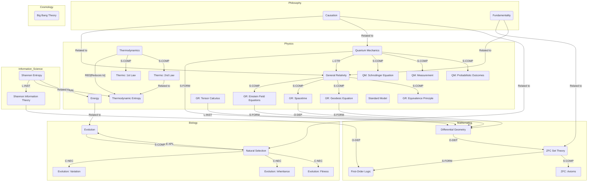

```mermaid
graph TD

subgraph Physics
PHY-GR(General Relativity)
PHY-GR-EFE["GR: Einstein Field Equations"]
PHY-GR-GEODESIC["GR: Geodesic Equation"]
PHY-GR-SPACETIME["GR: Spacetime"]
PHY-GR-TENSORCALC["GR: Tensor Calculus"]
PHY-GR-EQUIV["GR: Equivalence Principle"]
PHY-QM(Quantum Mechanics)
PHY-QM-SCHROD["QM: Schrodinger Equation"]
PHY-QM-MEASURE["QM: Measurement"]
PHY-QM-PROB["QM: Probabilistic Outcomes"]
PHY-THERMO(Thermodynamics)
PHY-THERMO-1STLAW["Thermo: 1st Law"]
PHY-THERMO-2NDLAW["Thermo: 2nd Law"]
PHY-ENTROPY(Thermodynamic Entropy)
PHY-ENERGY(Energy)
PHY-SM(Standard Model)
end

subgraph Mathematics
MATH-ZFC(ZFC Set Theory)
MATH-ZFC-AXIOMS["ZFC: Axioms"]
MATH-FOL(First-Order Logic)
MATH-DG["Differential Geometry"]
end

subgraph Philosophy
PHIL-CAUS(Causation)
PHIL-FUND(Fundamentality)
end

subgraph Biology
BIO-EVOL(Evolution)
BIO-NATSEL(Natural Selection)
BIO-VAR["Evolution: Variation"]
BIO-INHERIT["Evolution: Inheritance"]
BIO-FITNESS["Evolution: Fitness"]
end

subgraph Information_Science
INFO-SHAN(Shannon Information Theory)
INFO-ENTROPY(Shannon Entropy)
end

subgraph Cosmology
COSMO-BBT(Big Bang Theory)
end

PHY-GR-EFE -- S-FORM --> MATH-DG
PHY-GR-SPACETIME -- O-DEP --> MATH-DG
PHY-GR-GEODESIC -- S-FORM --> MATH-DG
PHY-GR -- S-COMP --> PHY-GR-EFE
PHY-GR -- S-COMP --> PHY-GR-SPACETIME
PHY-GR -- S-COMP --> PHY-GR-GEODESIC
PHY-GR -- S-COMP --> PHY-GR-EQUIV
PHY-GR-TENSORCALC -- L-INST --> MATH-DG
MATH-DG -- O-DEP --> MATH-ZFC
MATH-ZFC -- S-FORM --> MATH-FOL
MATH-ZFC -- S-COMP --> MATH-ZFC-AXIOMS
INFO-SHAN -- O-DEP --> MATH-FOL
INFO-ENTROPY -- L-INST --> INFO-SHAN
INFO-ENTROPY -- E-ANL --> PHY-ENTROPY
INFO-ENTROPY --> |Related to| PHY-ENERGY
PHY-THERMO -- RED[Reduces to] --> PHY-ENTROPY
PHY-THERMO -- S-COMP --> PHY-THERMO-1STLAW
PHY-THERMO -- S-COMP --> PHY-THERMO-2NDLAW
PHY-THERMO-2NDLAW --> |Related to| PHY-ENTROPY
PHY-QM -- S-FORM --> MATH-DG
PHY-QM -- L-CTR --> PHY-GR
PHY-QM -- S-COMP --> PHY-QM-SCHROD
PHY-QM -- S-COMP --> PHY-QM-MEASURE
PHY-QM -- S-COMP --> PHY-QM-PROB
BIO-EVOL -- S-COMP --> BIO-NATSEL
BIO-NATSEL -- C-NEC --> BIO-VAR
BIO-NATSEL -- C-NEC --> BIO-INHERIT
BIO-NATSEL -- C-NEC --> BIO-FITNESS
BIO-NATSEL -- E-XPL --> BIO-EVOL
PHIL-CAUS --> |Related to| PHY-GR
PHIL-CAUS --> |Related to| PHY-QM
PHIL-CAUS --> |Related to| BIO-NATSEL
PHIL-FUND --> |Related to| MATH-ZFC
PHIL-FUND --> |Related to| PHY-GR
PHY-ENERGY --> |Related to| BIO-EVOL
```
