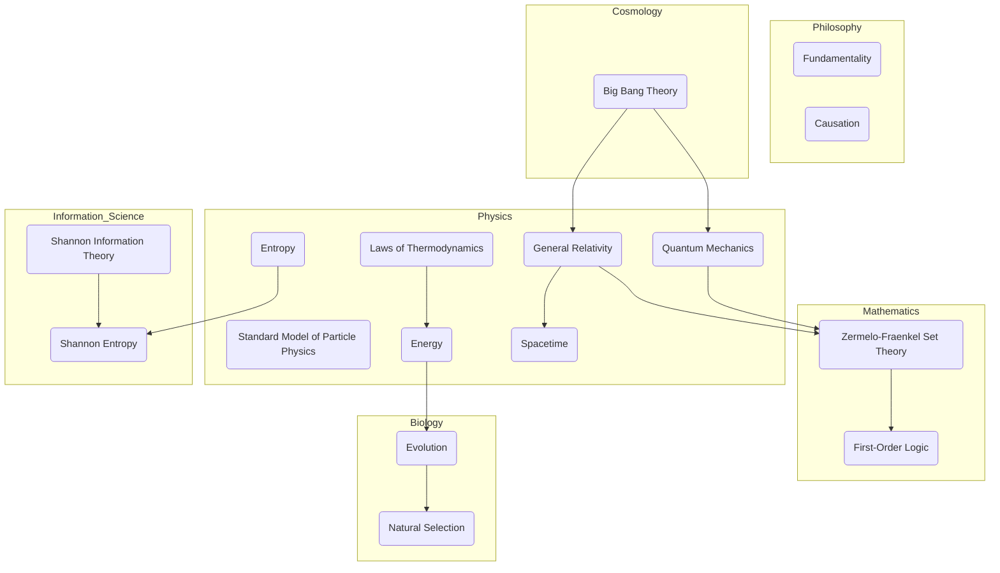

Sure, here is a string graph network in Mermaid format that represents the findings from the provided text:

This graph visually represents the entities and their relationships across different domains. It shows how concepts like Energy and Entropy bridge Physics and other fields, and how mathematical foundations like ZFC and FOL underlie Physics and Cosmology.
