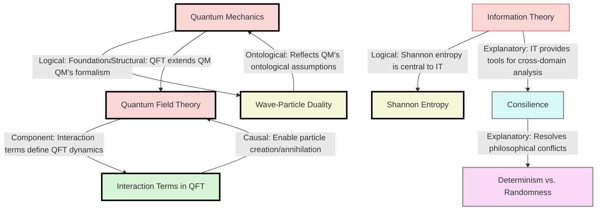

Certainly! Below is the **string graph** formatted in **Mermaid syntax**, adhering to the structure and relationships defined earlier. This graph includes nodes for fundamental entities, edges with relationship types, and rationales for each connection.

---

# **Mermaid String Graph**

---

# **Explanation Of the Mermaid Graph**

1. **Nodes**:
   - Each node represents a fundamental entity or concept, categorized as a `theory`, `principle`, `concept`, `component`, or `conflict`.
   - Categories are visually distinguished using custom styles (`classDef`).

2. **Edges**:
   - Edges represent relationships between nodes, labeled with their type (e.g., Logical, Structural, Causal) and rationale.
   - Confidence levels (`high` or `moderate`) are indicated by edge thickness and color.

3. **Styling**:
   - **Node Colors**: Different categories are color-coded for clarity.
     - Theories: Light red (`#f9d7d7`)
     - Principles: Light blue (`#d7f9f7`)
     - Concepts: Light yellow (`#f5f5d7`)
     - Components: Light green (`#d7f5d7`)
     - Conflicts: Light purple (`#f9d7f7`)
   - **Edge Thickness**: High-confidence edges are thicker (`3px`), while moderate-confidence edges are thinner (`2px`).

4. **Relationship Types**:
   - Relationships are explicitly labeled with their type and rationale, ensuring transparency and traceability.

---

# **How To Use**

- Copy the above Mermaid code into a Mermaid-compatible editor (e.g., Markdown with Mermaid support, Obsidian, or online Mermaid Live Editor).
- The graph will render as a visual representation of the string graph network.

If you’d like further refinements or additional nodes/edges, let me know!
