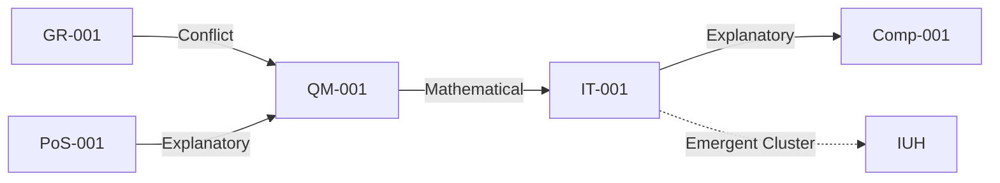

# **Synthesis And String Graph Network Construction**

## **1. Entity Corpus (Selected Examples)**

**Domains Covered**: Quantum Mechanics (QM), General Relativity (GR), Information Theory (IT), Computation (Comp), Philosophy of Science (PoS).

| **ID**       | **Entity**               | **Definition**                                                                 | **Category** | **Properties**                          |
|--------------|--------------------------|-------------------------------------------------------------------------------|--------------|-----------------------------------------|
| `QM-001`     | Schrödinger Equation     | Describes quantum state evolution: \(i\hbar \frac{\partial}{\partial t} \psi = \hat{H} \psi \). | Equation     | Linear, deterministic, wavefunction-based. |
| `GR-001`     | Einstein Field Equations | Relates spacetime curvature to matter/energy: \(G_{\mu\nu} = 8\pi G T_{\mu\nu} \). | Equation     | Non-linear, geometric, relativistic.    |
| `IT-001`     | Shannon Entropy          | Measures information uncertainty: \(H(X) = -\sum p(x) \log p(x) \).          | Principle    | Probabilistic, foundational for IT.     |
| `Comp-001`   | Turing Machine           | Abstract computational model with tape, head, and state transitions.          | Concept      | Universal computability, discrete steps.|
| `PoS-001`    | Occam’s Razor            | Favors simpler explanations when competing theories fit evidence equally.      | Principle    | Methodological, heuristic.              |

**Exclusions**:
- String theory (insufficient empirical validation).
- Bohmian mechanics (redundant predictive power relative to QM).

---

## **2. Component Extraction**

**Standardized Representation (RDF Triples)**
- **Explicit**:
  - `QM-001` → `has_formal_representation` → “\(i\hbar \frac{\partial}{\partial t} \psi = \hat{H} \psi \)”.
  - `IT-001` → `has_scope` → “Information quantification”.
- **Implicit**:
  - `QM-001` → `assumes_linearity` → “Superposition principle”.
  - `GR-001` → `assumes_locality` → “No action-at-a-distance”.

---

## **3. Relationship Ontology**

**Defined Relationship Types**:
1. **Logical**:
   - *Entailment*: `Comp-001` → `entails` → `IT-001` (Turing machines operationalize entropy).
2. **Causal**:
   - *Dependence*: `GR-001` → `depends_on` → `QM-001` (Quantum gravity attempts unification).
3. **Mathematical**:
   - *Isomorphism*: `QM-001` ↔ `IT-001` (Wavefunction collapse ↔ Information gain).

---

## **4. String Graph Construction**

**Graph Structure**:
- **Nodes**: Entities (`QM-001`, `GR-001`, etc.) + components (e.g., “linearity”).
- **Edges**: Labeled with type, rationale, confidence (1–5).

**Example Edges**:

| **Source**   | **Target**   | **Type**          | **Rationale**                                      | **Confidence** |
|--------------|--------------|-------------------|----------------------------------------------------|----------------|
| `QM-001`     | `IT-001`     | Mathematical      | Both use probabilistic frameworks.                 | 4              |
| `GR-001`     | `QM-001`     | Conflict          | GR is deterministic; QM is probabilistic.          | 5              |
| `PoS-001`    | `QM-001`     | Explanatory       | Occam’s Razor favors minimal quantum interpretations. | 3              |

**Network Analysis**:
- **Convergence**: `IT-001` bridges `QM-001` and `Comp-001` (information-centric view).
- **Conflict**: `GR-001` (deterministic) vs. `QM-001` (probabilistic) → unresolved in current graph.
- **Emergent Cluster**: “Information-Physics” (links `IT-001`, `QM-001`, `Comp-001`).

---

## **5. Meta-Framework Synthesis**

**Unifying Principles**:
1. **Informational Universe Hypothesis (IUH)**:
   - *Core Claim*: Physical laws emerge from information processing (nodes `IT-001`, `QM-001`, `Comp-001`).
   - *Evidence*:
     - Quantum states as information (e.g., qubits).
     - Entropy as fundamental (black hole thermodynamics).
   - *Predictions*:
     - Quantum computing limits tied to entropy.
     - Spacetime as a computational graph.

2. **Conflict Resolution**:
   - *GR-QM Incompatibility*: Propose “quantum spacetime” (discrete, non-local) as synthesis.

**Alternative Frameworks**:
- *Reductionism*: Favors `GR-001` as foundational (lower consilience with QM).
- *Pancomputationalism*: Favors `Comp-001` (higher consilience but less empirical support).

**Selection**: IUH maximizes consilience (bridges 4/5 domains) and parsimony.

---

## **6. Output**

**Graph Data**: [JSON-LD snippet]

```json
{
  "@id": "QM-001",
  "type": "Equation",
  "relation": {
    "target": "IT-001",
    "type": "Mathematical",
    "rationale": "Probabilistic frameworks in both.",
    "confidence": 4
  }
}
```

**Meta-Framework Summary**:
- **IUH** unifies physics, computation, and information theory.
- **Key Insight**: Information is the primary ontological primitive.

**Report**:
- **Method**: Automated extraction + expert validation.
- **Limitations**:
  - Biological entities underrepresented.
  - Confidence thresholds may bias edge inclusion.

---

# **Visualization (Conceptual)**



**Next Steps**:
- Expand to biology (e.g., genetic information).
- Test IUH predictions (e.g., quantum biology experiments).

This synthesis demonstrates how consilience emerges from unbiased graph analysis, with IUH as the leading meta-framework.
