Here’s the corrected and validated Mermaid JS code for the math domain edge relationships:

```mermaid
graph TD
    %% === INTRA-MATH CONNECTIONS (9 edges) ===
    Math-π-01["Math-π-01: Pi (π)"] -->|"Fundamental<br>constant"| Math-π-02["Math-π-02: Fourier Series"]
    Math-π-01 -->|"Geometric<br>basis"| Math-π-03["Math-π-03: Modular Arithmetic"]
    Math-π-02 -->|"Special case"| Math-π-04["Math-π-04: Repeating Decimals"]
    Math-α-05["Math-α-05: Limit Transitions"] -->|"Generalizes"| Math-ε-06["Math-ε-06: Bifurcation Theory"]
    Math-ε-06 -->|"Quantifies"| Math-ε-07["Math-ε-07: Phase Space Transitions"]
    Math-ε-07 -->|"Topological<br>extension"| Math-ε-08["Math-ε-08: Topological Changes"]
    Math-ε-08 -->|"Critical case"| Math-ε-09["Math-ε-09: Critical Points"]
    Math-π-03 -->|"Discrete<br>version"| Math-α-05
    Math-π-04 -->|"Periodic<br>behavior"| Math-ε-06

    %% === MATH → PHYSICS (7 edges) ===
    Math-π-01 -->|"Circle<br>geometry"| Phys-π-02["Phys-π-02: Planetary Orbits"]
    Math-π-02 -->|"Wave<br>decomposition"| Phys-π-03["Phys-π-03: Wave Cycles"]
    Math-α-05 -->|"Continuum<br>limit"| Phys-α-05["Phys-α-05: Reynolds Number"]
    Math-ε-06 -->|"Chaos<br>modeling"| Phys-ε-10["Phys-ε-10: Turbulence Onset"]
    Math-ε-07 -->|"Phase space<br>mapping"| Phys-ε-08["Phys-ε-08: Superconductivity"]
    Math-ε-09 -->|"Criticality<br>analysis"| Phys-α-07["Phys-α-07: Phase Transitions"]
    Math-π-03 -->|"Modular<br>symmetry"| Phys-π-04["Phys-π-04: Quantum Spin"]

    %% === MATH → OTHER DOMAINS (6 edges) ===
    Math-π-01 -->|"Cyclic<br>patterns"| Bio-π-03["Bio-π-03: Predator-Prey"]
    Math-ε-06 -->|"Threshold<br>models"| Soc-α-05["Soc-α-05: Tipping Points"]
    Math-π-02 -->|"Harmonic<br>analysis"| Art-π-02["Art-π-02: Musical Refrains"]
    Math-α-05 -->|"Boundary<br>conditions"| Esot-α-05["Esot-α-05: Numerology (α=1)"]
    Math-π-04 -->|"Recurrence<br>patterns"| Soc-π-03["Soc-π-03: Election Cycles"]
    Math-ε-08 -->|"Structural<br>changes"| Art-ε-06["Art-ε-06: Avant-Garde"]

    %% === STYLING ===
    class Math-π-01,Math-π-02,Math-π-03,Math-π-04,Math-α-05,Math-ε-06,Math-ε-07,Math-ε-08,Math-ε-09 math;
    class Phys-π-02,Phys-π-03,Phys-α-05,Phys-ε-10,Phys-ε-08,Phys-α-07,Phys-π-04 physics;
    class Bio-π-03,Soc-α-05,Art-π-02,Esot-α-05,Soc-π-03,Art-ε-06 other;
    
    classDef math fill:#f9f,stroke:#333;
    classDef physics fill:#bbf,stroke:#333;
    classDef other fill:#ccc,stroke-dasharray:3,3;

    linkStyle 0,1,2,3,4,5,6,7,8 stroke:#f66,stroke-width:2px;
    linkStyle 9,10,11,12,13,14,15 stroke:#66f,stroke-width:2px;
    linkStyle 16,17,18,19,20,21 stroke:#999,stroke-width:1.5px;
```

Key fixes made:

1. Separated all class definitions and styling into distinct blocks
2. Removed comments between style declarations
3. Fixed `stroke-dasharray` syntax (removed space after comma)
4. Ensured all statements end properly (no unterminated lines)

The diagram now shows:

- 9 intra-math connections (red)
- 7 math→physics connections (blue)
- 6 cross-domain connections (gray)
With clear color-coding and dashed borders for non-core domains.
