Here’s the complete **Physics domain edge relationship graph** in Mermaid JS format, showing all 31 intra-domain and cross-domain connections for physics entities:

```mermaid
graph TD
    %% === INTRA-PHYSICS CONNECTIONS (15 edges) ===
    Phys-π-01["Phys-π-01: Harmonic Oscillator"] -->|"Classical limit"| Phys-π-04["Phys-π-04: Quantum Spin"]
    Phys-π-02["Phys-π-02: Planetary Orbits"] -->|"Relativistic correction"| Phys-ε-12["Phys-ε-12: Cosmic Inflation"]
    Phys-π-03["Phys-π-03: Wave Cycles"] -->|"Quantization"| Phys-π-04
    Phys-α-05["Phys-α-05: Reynolds Number"] -->|"Transition to"| Phys-ε-10["Phys-ε-10: Turbulence Onset"]
    Phys-α-06["Phys-α-06: Critical Opalescence"] -->|"Phase"| Phys-α-07["Phys-α-07: Phase Transitions"]
    Phys-α-07 -->|"Superconducting"| Phys-ε-08["Phys-ε-08: Superconductivity"]
    Phys-ε-08 -->|"Symmetry"| Phys-ε-09["Phys-ε-09: Symmetry Breaking"]
    Phys-ε-09 -->|"Leads to"| Phys-ε-11["Phys-ε-11: Quantum Decoherence"]
    Phys-π-01 -->|"Nonlinear extension"| Phys-ε-10
    Phys-π-03 -->|"Energy cascade"| Phys-ε-10
    Phys-α-05 -->|"Dimensionless ratio"| Phys-α-06
    Phys-ε-08 -->|"Cosmological analog"| Phys-ε-12
    Phys-ε-09 -->|"Inflationary mechanism"| Phys-ε-12
    Phys-π-02 -->|"Perturbation source"| Phys-ε-11
    Phys-π-04 -->|"Measurement effect"| Phys-ε-11

    %% === PHYSICS → MATH (7 edges) ===
    Phys-π-01 -->|"Solved via"| Math-π-02["Math-π-02: Fourier Series"]
    Phys-π-03 -->|"Described by"| Math-π-01["Math-π-01: Pi (π)"]
    Phys-α-05 -->|"Derived from"| Math-α-05["Math-α-05: Limit Transitions"]
    Phys-ε-10 -->|"Modeled with"| Math-ε-06["Math-ε-06: Bifurcation Theory"]
    Phys-α-07 -->|"Critical exponents"| Math-ε-09["Math-ε-09: Critical Points"]
    Phys-π-04 -->|"Spinor math"| Math-π-03["Math-π-03: Modular Arithmetic"]
    Phys-ε-12 -->|"Metric solutions"| Math-ε-08["Math-ε-08: Topological Changes"]

    %% === PHYSICS → OTHER DOMAINS (9 edges) ===
    Phys-π-02 -->|"Seasonal effects"| Bio-π-01["Bio-π-01: Circadian Rhythms"]
    Phys-α-05 -->|"Flow analogs"| Bio-ε-10["Bio-ε-10: Neural Firing"]
    Phys-ε-08 -->|"Emergent order"| Soc-ε-07["Soc-ε-07: Cultural Shifts"]
    Phys-π-03 -->|"Acoustic patterns"| Art-π-02["Art-π-02: Musical Refrains"]
    Phys-ε-09 -->|"Symmetry concepts"| Art-ε-06["Art-ε-06: Avant-Garde"]
    Phys-π-04 -->|"Quantum mysticism"| Esot-π-02["Esot-π-02: Lunar Nodes"]
    Phys-ε-12 -->|"Cycle universe"| Esot-ε-09["Esot-ε-09: Astrological Ages"]
    Phys-π-01 -->|"Pendulum art"| Art-α-04["Art-α-04: Key Modulation"]
    Phys-α-06 -->|"Critical phenomena"| Soc-α-05["Soc-α-05: Tipping Points"]

    %% === STYLING ===
    class Phys-π-01,Phys-π-02,Phys-π-03,Phys-π-04,Phys-α-05,Phys-α-06,Phys-α-07,Phys-ε-08,Phys-ε-09,Phys-ε-10,Phys-ε-11,Phys-ε-12 physics;
    class Math-π-01,Math-π-02,Math-π-03,Math-α-05,Math-ε-06,Math-ε-08,Math-ε-09 math;
    class Bio-π-01,Bio-ε-10,Soc-ε-07,Soc-α-05,Art-π-02,Art-α-04,Art-ε-06,Esot-π-02,Esot-ε-09 other;

    classDef physics fill:#bbf,stroke:#333;
    classDef math fill:#f9f,stroke:#333;
    classDef other fill:#ccc,stroke-dasharray:3,3;

    linkStyle 0,1,2,3,4,5,6,7,8,9,10,11,12,13,14 stroke:#66f,stroke-width:2px;
    linkStyle 15,16,17,18,19,20,21 stroke:#f66,stroke-width:2px;
    linkStyle 22,23,24,25,26,27,28,29,30 stroke:#999,stroke-width:1.5px;
```

# Key Features

1. **Complete Physics-Centric Edges**: All 31 connections where physics entities are sources
2. **Domain Coloring**:
   - **Blue**: Physics nodes
   - **Pink**: Math nodes
   - **Gray**: Other domains (dashed border)
3. **Edge Types**:
   - **Blue**: Intra-physics relationships
   - **Red**: Physics→Math connections
   - **Gray**: Physics→Other domain links
4. **Core Physics Patterns**:
   - Classical→Quantum transitions (Harmonic Oscillator → Quantum Spin)
   - Phase transition hierarchy (Critical Opalescence → Superconductivity)
   - Cosmic connections (Planetary Orbits → Cosmic Inflation)

# Notable Connections

- **Strong Math Links**: 7 edges to mathematical foundations (Fourier, Pi, Critical Points)
- **Biology Bridges**: Neural firing thresholds analogize to turbulence (Confidence=4)
- **Esoteric Links**: Quantum Spin → Lunar Nodes is lowest-confidence edge (Confidence=1)

For domain-specific subgraphs (e.g., just quantum physics edges) or alternative formats, let me know!
