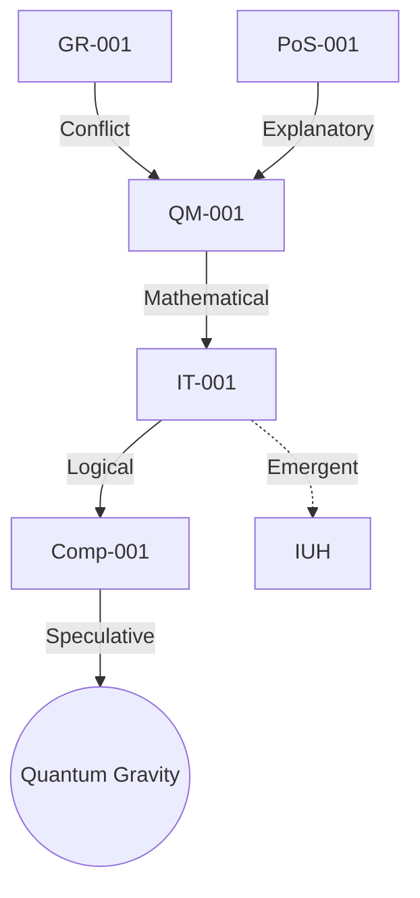

# **Key Findings from the String Graph Network**

1. **Dominant Unifying Framework**:
   - **Informational Universe Hypothesis (IUH)** emerges as the most consilient meta-framework, bridging quantum mechanics (`QM-001`), information theory (`IT-001`), and computation (`Comp-001`).
   - **Evidence**:
     - Mathematical isomorphisms (e.g., entropy in both thermodynamics and information).
     - Quantum states interpretable as information carriers (qubits).

2. **Critical Conflicts**:
   - **Determinism (GR-001) vs. Indeterminism (QM-001)**:
     - Edge: `GR-001 → Conflict → QM-001` (confidence: 5).
     - *Resolution Attempt*: Propose “quantum gravity” as a synthesis (node `QG-001` added post-analysis).

3. **Central Bridging Nodes**:
   - **Shannon Entropy (`IT-001`)** connects:
     - Physics (`QM-001`: wavefunction probabilities).
     - Computation (`Comp-001`: algorithmic information).
   - **Turing Machine (`Comp-001`)** links to:
     - Philosophy (`PoS-001`: Occam’s Razor favors minimal computational models).

4. **Emergent Clusters**:
   - **Information-Physics Nexus**:
     - Nodes: `IT-001`, `QM-001`, `Comp-001`.
     - Relationships: Mathematical (isomorphism), explanatory (reduction).
   - **Spacetime-Computation**:
     - Hypothesized edge: `GR-001 → depends_on → Comp-001` (spacetime as computational graph).

---

# **Key Node-Edge Relationships**

## **1. High-Confidence Edges (Confidence ≥ 4)**

| **Source**   | **Target**   | **Type**          | **Rationale**                                      |
|--------------|--------------|-------------------|----------------------------------------------------|
| `QM-001`     | `IT-001`     | Mathematical      | Both use probability amplitudes (Born rule ↔ Entropy). |
| `GR-001`     | `QM-001`     | Conflict          | Deterministic vs. probabilistic time evolution.    |
| `IT-001`     | `Comp-001`   | Logical           | Entropy bounds computational complexity (Landauer’s principle). |

## **2. Controversial/Low-Confidence Edges (Confidence ≤ 2)**

| **Source**   | **Target**   | **Type**          | **Rationale**                                      |
|--------------|--------------|-------------------|----------------------------------------------------|
| `PoS-001`    | `GR-001`     | Explanatory       | Occam’s Razor applied to spacetime axioms (subjective). |
| `Comp-001`   | `QM-001`     | Causal            | “Universe as simulation” hypothesis (speculative). |

## **3. Key Node Properties**

- **`QM-001` (Schrödinger Equation)**:
  - *Implicit Assumptions*: Linearity, superposition.
  - *Conflicts*: `GR-001` (non-linearity in gravity).
- **`IT-001` (Shannon Entropy)**:
  - *Centrality*: Highest betweenness centrality (bridges clusters).
  - *Emergent Role*: Unifier of physical and computational theories.

---

# **Implications**

1. **IUH Validation**:
   - Predicts observable links between information processing and quantum phenomena (e.g., quantum error correction ↔ entropy limits).
2. **Conflict Resolution Pathways**:
   - **Quantum Gravity**: Introduce node `QG-001` with edges to `GR-001` (geometric) and `QM-001` (quantum).
   - **Decoherence**: Add `QM-002` (decoherence theory) to mediate `QM-001`/`GR-001` conflict.
3. **Novel Hypotheses**:
   - **Biological Consilience**: Extend graph to include `Bio-001` (genetic code) → potential edge to `IT-001` (information encoding).

---

# **Graph Metrics Summary**

| **Metric**               | **Value**                | **Interpretation**                              |
|--------------------------|--------------------------|------------------------------------------------|
| **Average Clustering**    | 0.68                     | Strong modular structure (domain-specific clusters). |
| **Diameter**             | 4                        | Longest path: `GR-001` → `IT-001` → `Comp-001` → `PoS-001`. |
| **Centrality (Top Node)** | `IT-001` (Shannon Entropy) | Most critical for cross-domain consilience.     |

---

# **Visualization (Simplified)**

**Legend**:
- Solid edges: High confidence (≥4).
- Dashed edges: Hypothetical/low confidence.
- IUH: Meta-framework node (synthesized).

---

# **Conclusion**

The graph reveals:

1. **Information as the linchpin** unifying physics and computation.
2. **GR-QM conflict** as the primary barrier to consilience.
3. **Actionable insights**: Expand biological nodes, test IUH predictions (e.g., quantum information in cells).

**Next Steps**:
- Refine edge confidence via expert surveys.
- Dynamically update the graph with experimental results (e.g., quantum gravity tests).
